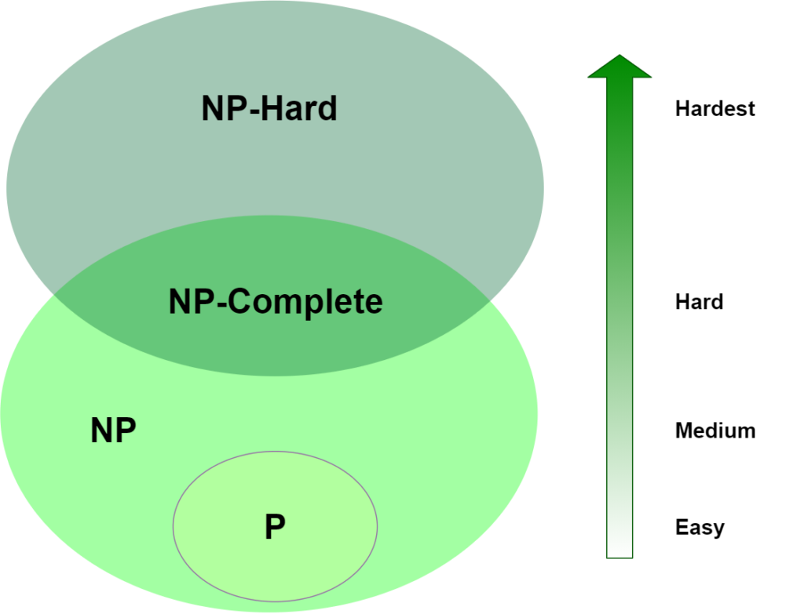

# Computational Complexity Theory

## Complexity Classes

## Definitions

- **P**: A class of problems that can be solved in polynomial time by a deterministic turing machine. P for polynomial.
- **NP**: A class of problems that can be solved in polynomial time by a non-deterministic turing machine. NP for Non-deterministic Polynomial.
- **NP-Hard**: A class of problems that are _at least as hard_ as the hardest problems in NP. NP-Hard problems are not restricted to decision problems. We will see many of the Optimization Problems will be NP-Hard
- **NP-Complete**: A class of problems that are both in **NP** and **NP-HARD**. This class of problems is reserved to decision problems.

## Reductions

An important tool that we use when proving the complexity class of a given problem is that of a reduction. A reduction is simply an algorithm that transfers one instance of a problem into an instance of another problem. The idea is as follows: If we can transfer the instance of one problem into another, then both problems can be solved in the same time. To prove that a problem is in **NP-Complete**, for example, we must show that the problem is in **NP** and then we can find a reduction between an instance of our new problem and an instance of a known **NP-Complete** Problem.

Check out [Karp's 21 NP-complete problems](https://en.wikipedia.org/wiki/Karp%27s_21_NP-complete_problems) for how different NP-Copmlete problems reduce to each other.

<!-- ## NP-Complete vs NP-Hard -->

## Known NP-Complete Problems

The following is a list of NP-Complete problems that have been studied in previous courses or are important for this course.

- $\verb|SAT|$
- $\verb|3SAT|$
- $\verb|Vertex Coloring|$
- $\verb|X3-SAT|$

## NP-Complete Problems introduced in class

- $\verb|OptLin-0-1-Dec|$ (reduced to $\verb|3SAT|$)
- $\verb|OptQuad-0-1-Dec|$ (reduced to $\verb|OptLin-0-1-Dec|$)