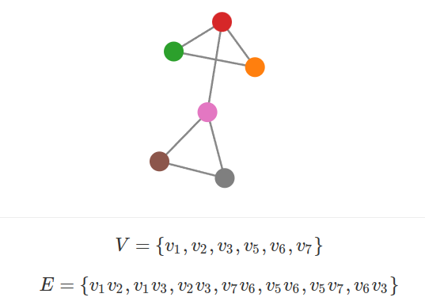
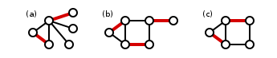
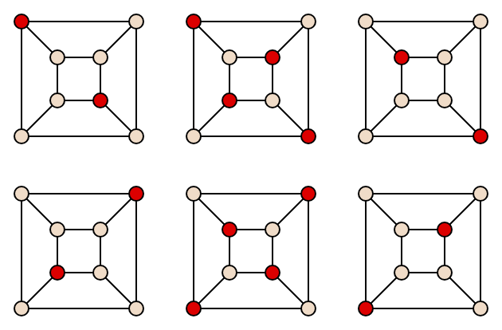

# Graph Theory

This wiki will briefly introduce the most important Graph Theory topics that are needed for Optimisation Combinatoire

## Formalisms

A Graph $G$ is a set of Vertices $V$ and Edges $E$ written $$G = \langle V, E \rangle$$

## Defintions

- **Connected** (vertices): for an undirected graph $G$, two vertices $u$ and $v$ are **connected** if $G$ contains a **path** from $u$ to $v$
- **Connected** (graph): a graph $G = \langle V, E \rangle$ is said to be connected if every pair of vertices $u$ and $v$ are connected. In other words, there exists a path between every pair of vertices $u$ and $v$.
- **Connected component**: A maximal connected subgraph of an undirected graph. A graph is connected if and only if it has _exactly one_ connected component.
- **Matching (couplage)**: A set of edges that don't share any vertices

- **Independent set (stable)**: A set of vertices in a graph, no two of which are adjacent. In other words, a set $S$ of vertices such that for every $u$, $v$ in $S$, there is no edge $uv$ connecting the two

    {width="200"}

## Algorithms

- **Kosaraju's algorithm**: Compute strongly connected components in linear time!